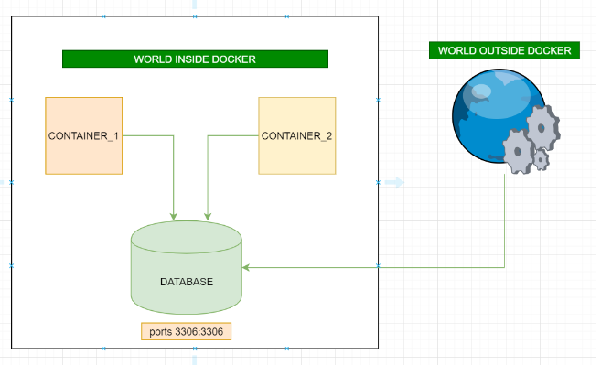
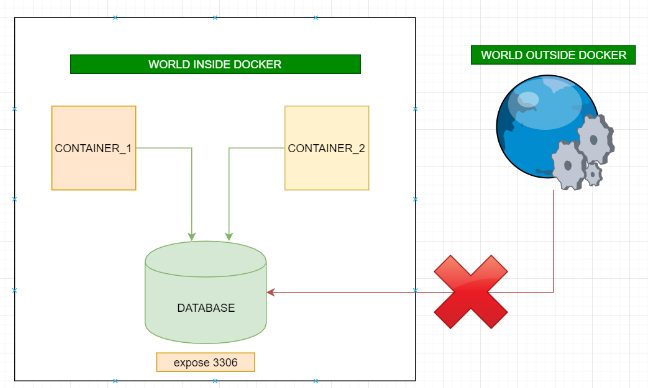
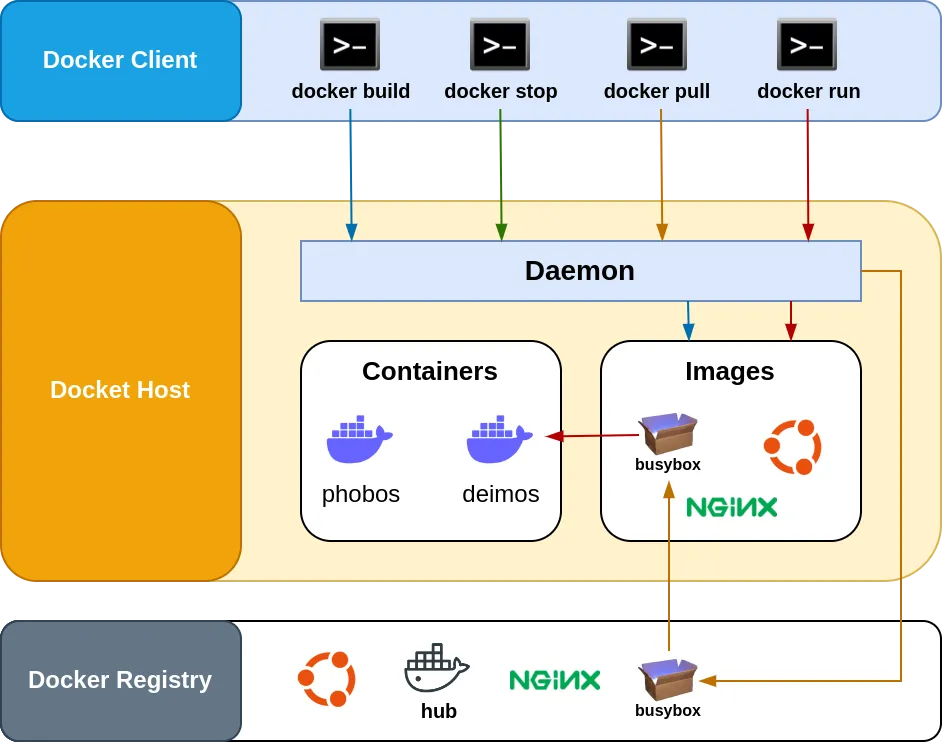

# Docker Compose

## build a fully managed application
- To build an app with compose we run:
```bash
docker-compose build
```
- Without cache:
```bash
docker-compose build --no-cache
```


## Run the app's image in a container
```bash
docker-compose up
```
- if the image is not built, docker-compose will build it first and then run it.

- Build and start the app in the background:
```bash
docker-compose up -d
```

## Free up the resources (delete the containers)
```bash
docker-compose down
```
- Note that the images are not deleted, only the containers.


# Mongodb with Docker
- to use mongo container 
```bash
docker run --name my-mongo -d -p 27017:27017 mongo
```
Then use the interactive mode to connect to the container:
```bash
docker exec -it <container_id or name> /bin/bash
```
Then run the mongo shell:
```bash
mongosh
```

# ports vs expose
- ports:
1. Activates the container to listen for specified port(s) from the world outside of the docker (can be the same host machine or a different machine) AND is also accessible to the world inside Docker.
2. More than one port can be specified (that's why it's ports not port).


- expose:
1. Activates container to listen for a specific port only from the world inside of docker AND is not accessible to the world outside of Docker.
2. More than one port can be specified.


# Docker Networking
- Docker daemon:
AKA “Dockerd,” is a core component of the Docker platform. It is responsible for managing Docker objects like images, containers, networks, and volumes, and it acts as the intermediary between the Docker CLI (Command Line Interface) and the container runtime. The Docker daemon runs as a background process on the host machine and listens for Docker API requests.


- Docker DNS
When we run our app using docker-compose, Like we discuss earlier, Docker-compose automatically sets up a bridge network, which acts as a virtual network switch connecting all containers in that network. The Docker daemon acts as the DHCP server for this bridge network, providing IP addresses to containers and handling their DNS resolution.

To learn more about Docker networking, check out this medium article: [Docker Networking](https://medium.com/@kesaralive/diving-deeper-into-docker-networking-with-docker-compose-737e3b8a3c8c)


# Viewing logs
- To view the logs across all the containers:
```bash
docker-compose logs
```
- To view the logs of a specific container and follow them:
```bash
docker-compose logs -f <container_name>
```


# Publishing changes with the container
- To publish changes to the container so we don't need to rebuild our app images each time we 
make a change in the code, for that we add a volume to each service in the docker-compose file
to map the local directory to the container directory (/app in our case).
```yaml
services:
  app:
    build: ./server
    volumes:
      - ./server:/app
```

- run npm i before uncommenting the volumes in docker-compose file to avoid the error of not finding the node_modules directory.

# DB migrations
- One thing to take care of is wait until the database is up and running before running the migrations.
- To do that we can use a tool like wait-for-it.sh or wait-for.sh. and add it to the command in the docker-compose file.
```bash
command: ./wait-for-it.sh db:27017 && migrate-mongo up && npm start
```